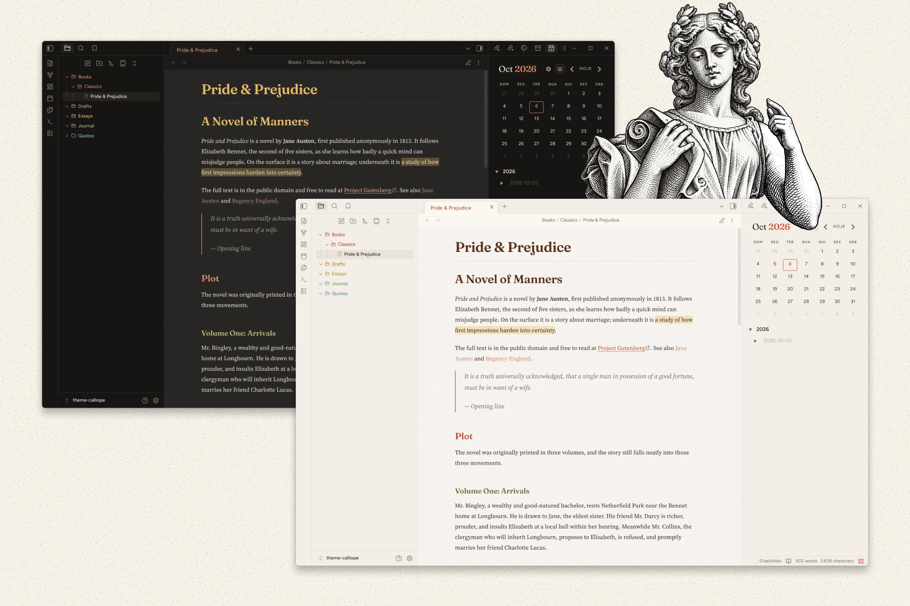

# Calliope
An editorial theme for [Obsidian](https://obsidian.md). Cream paper and ink in light mode, paper by candlelight in dark mode, with typography borrowed from books and magazines.

## Features
- **Editorial typography**: a serif for body text, a display serif for headings, and a clean sans-serif for the interface.
- **Light and dark modes**: warm cream paper with a terracotta accent, and a dark mode tuned to feel like reading by candlelight.
- **Comfortable reading**: generous line height and a narrow line width, like a printed page.
- **Paper grain**: a subtle noise texture over the note area.
- **Book-style headings**: small headings (h4–h6) in spaced uppercase, and a hairline rule under the note title.
- **Ornamental dividers**: horizontal rules (`---`) become a centered ⁂.
- **Clean tables**: horizontal rules only.
- **Magazine-style blockquotes**: slightly larger and in italics.
- **Code blocks**: a dashed border over a dot pattern.
- **Colorful file explorer**: folder and file icons, with six folder colors applied in sequence.
- **Paper-like tabs**: the active tab title uses the accent color and casts a soft shadow, like a sheet resting on another.

## Fonts
The fonts are not bundled with the theme. For the intended look, install them on your system. All four are free:

|Use|Font|
|---|---|
|Body text|[Source Serif 4](https://fonts.google.com/specimen/Source+Serif+4)|
|Headings|[Fraunces](https://fonts.google.com/specimen/Fraunces)|
|Interface|[Figtree](https://fonts.google.com/specimen/Figtree)|
|Code|[JetBrains Mono](https://fonts.google.com/specimen/JetBrains+Mono)|
Without them, the theme falls back to similar fonts already on your system.

## Installation
### From Obsidian
1. Open **Settings → Appearance**.
2. Under **Themes**, select **Manage**.
3. Search for **Calliope** and select **Install and use**.

### Manually
1. Download `manifest.json` and `theme.css` from the latest release.
2. In your vault, create the folder `.obsidian/themes/Calliope/`.
3. Move both files into that folder.
4. Open **Settings → Appearance** and choose **Calliope** under **Themes**.

## Credits
- File explorer icons from [Lucide](https://lucide.dev), under the ISC license.